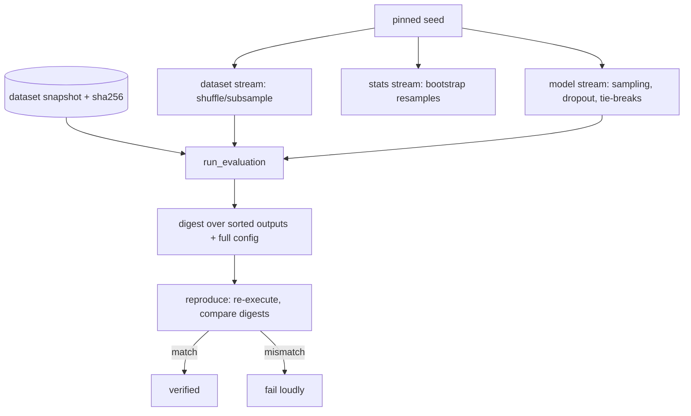

# EvalForge

Reproducible ML evaluation: pinned seeds, content-hashed datasets,
digest-verified runs, statistical comparison, CI quality gates.
**No PyTorch, no TensorFlow** — models are plain callables (or any
executable speaking JSON over stdio), metrics and statistics are implemented
from scratch on numpy. Nothing to install beyond numpy.

**Who it's for:** researchers comparing checkpoints, teams gating releases on
metric floors, and anyone who has ever been asked "can you reproduce that
number?" and flinched.

## How reproducibility works



One integer seed fans out into independent per-stream RNGs (SHA-256
derivation), so changing the bootstrap seed can never perturb the model
stream. Datasets are snapshotted and hash-verified on load — a swapped file
fails instead of silently moving history.

## 60-second quickstart

```bash
pip install -e ".[dev,test]"
export EVALFORGE_STORE=./.evalforge PYTHONHASHSEED=0
evalforge init
evalforge synthesize --path demo.jsonl --n 200 --seed 4
evalforge register-dataset demo demo.jsonl
evalforge run --model examples.models:threshold_model --dataset demo \
  --seed 7 --metrics accuracy,f1_binary --name threshold-v1
# {"id": "...", "digest": "...", "aggregates": {"accuracy": 0.85, ...}}
evalforge reproduce <id> --model examples.models:threshold_model
# {"match": true, ...}
```

Compare two runs and gate a release:

```bash
evalforge compare <id-a> <id-b> --metric accuracy
evalforge gate --run <id> --rules '{"accuracy": {"min": 0.8}}'
evalforge gate --run <id> --rules '{"accuracy": {"max_drop": 0.02}}' \
  --baseline '{"accuracy": 0.87}'
```

## Design decisions

- **No framework.** A model is `(input, rng) -> output`. Anything — a scikit
  function, a subprocess, an API call wrapped in a 10-line adapter — plugs in.
  The framework owns everything nondeterministic *around* the model.
- **Stream-separated seeds.** `seeded_rng(seed, stream)` derives independent
  RNGs per stream from SHA-256. Global `random`/`numpy` are still seeded for
  legacy code, with `PYTHONHASHSEED` warnings when unset.
- **Content-bound everything.** Datasets by sha256, runs by digest over sorted
  outputs + full config. Reproduction is re-execution + digest equality, not
  eyeballing logs.
- **Statistics from scratch.** Percentile bootstrap CIs (seeded), exact
  binomial McNemar, win/loss/tie, unbiased pass@k. No scipy needed.
- **Gates are exit codes.** `gate` returns 0/1 for CI; unknown metrics and
  missing baselines fail instead of passing silently.
- **SQLite registry, JSON artifacts.** Runs live in `.evalforge/` — portable,
  diffable, backup-friendly.

Config is env-driven: `EVALFORGE_STORE` (default `./.evalforge`).

## CLI

`init`, `synthesize`, `register-dataset`, `run`, `reproduce`, `compare`,
`gate`, `report`, `list`, `seed-info`. Every command prints JSON.

## Testing / quality

```bash
make test       # pytest (28 tests, hand-computed expectations)
make lint       # ruff check + format --check
make typecheck  # mypy strict
make e2e        # CLI end-to-end smoke test
make audit      # pip-audit on the lockfile
```

## Project layout

```
src/evalforge/
  seeds.py      # validation, stream derivation, SeedBundle, runtime report
  datasets.py   # JSONL registry, hash verification, shuffle, synthesize
  metrics.py    # accuracy/F1/macro/MAE/RMSE/EM/token-F1/pass@k
  stats.py      # bootstrap CIs, exact McNemar, win/loss/tie
  runs.py       # run_evaluation, digest, artifacts, reproduce, loader
  compare.py    # paired comparison across runs
  gates.py      # CI quality gates
  cli.py        # argparse commands (JSON out)
  db.py models.py
examples/models.py  # constant/threshold/keyword/random baselines
```

## Limitations

- **No distributed execution.** One process, one machine; large suites shard by
  hand (`--limit` + offset conventions are yours to define).
- **Exact-match correctness for McNemar.** Comparison CIs use per-example
  error/correctness scores; exotic metrics compare via bootstrap only.
- **Subprocess models trust the operator.** The command runs locally with your
  privileges — sandbox it yourself for untrusted code.
- **Torch presence is reported, not managed.** If a model imports torch, seed
  it explicitly (see RUNBOOK); EvalForge will never do it behind your back.
